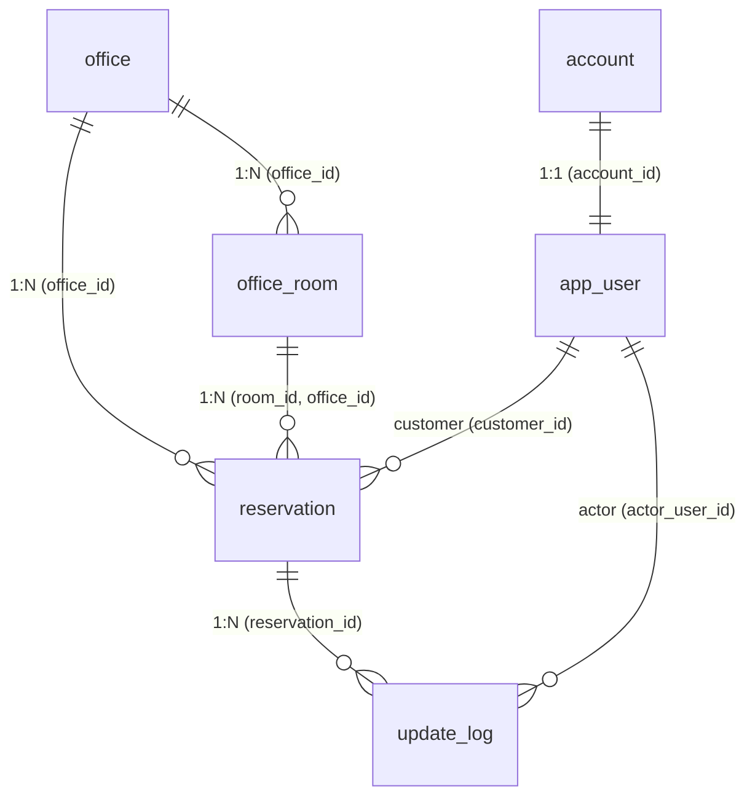

# 모두의 오피스 (Modu_office)

기업 시설·자원 예약 및 운영 관리 플랫폼

[](https://github.com/piker0925/Modu_office)

## 📋 개요

**Modu_office**는 기업의 회의실, 장비, 시설 등을 효율적으로 관리하고 예약할 수 있는 포괄적인 플랫폼입니다. 동시성 제어를 통한 중복 예약 방지, 실시간 동기화, 세밀한 권한 관리를 통해 기업의 자원을 최적으로 활용할 수 있습니다.

### 🎯 핵심 목표

- 회의실/장비 예약 시 **동시성 제어**로 중복 예약 방지
- **실시간 동기화**로 예약 현황을 동시에 반영
- **감사 로그**로 모든 변경을 추적
- **권한 기반 접근**으로 보안 의식 표현

---

## 🛠️ 기술 스택

| 항목 | 기술 | 용도 |
| --- | --- | --- |
| **프레임워크** | Spring Boot 3.3 | 웹 애플리케이션 |
| **ORM** | Spring Data JPA | 데이터베이스 매핑 |
| **인증** | Spring Security + JWT | 로그인, 권한 관리 |
| **실시간** | Spring WebSocket (STOMP) | 예약 동기화 |
| **데이터베이스** | PostgreSQL 15+ | 동시성 제어 우수 |
| **빌드** | Gradle | 의존성 관리 |
| **코드 생성** | Lombok | 보일러플레이트 제거 |
| **API 문서** | Springdoc OpenAPI | Swagger UI |
| **검증** | Jakarta Validation | 입력값 검증 |
| **테스트** | JUnit 5 | 단위 테스트 |
| **로깅** | SLF4J | 기록 추적 |
| **개발 도구** | Spring Boot DevTools | 핫 리로드 |

---

## 🚀 주요 기능

### 1. 지점 및 공간 관리

- ✅ 지점(Office) 생성 및 관리 (이름, 위치)
- ✅ 지점별 공간(Room) 관리 (코드, 층, 수용인원, 카테고리)
- ✅ 공간 상태 자동 관리 (available, inactive)

### 2. 예약 시스템

- ✅ 예약 생성 (지점, 공간, 시간 선택)
- ✅ **복합 무결성 제어**: (공간, 지점) 쌍을 검증하여 예약 일관성 보장
- ✅ 시간 충돌 방지 (PostgreSQL 인덱스 및 제약 조건 활용)
- ✅ 예약 조회 및 상태 관리 (PENDING, CONFIRMED, CANCELED)

### 3. 인증 및 권한 관리 (RBAC)

- ✅ 계정(Account)과 프로필(User) 분리 운영
- ✅ **CUSTOMER**: 일반 사용자 (예약 생성 및 본인 예약 조회)
- ✅ **OPERATOR**: 지점 운영자 (담당 지점 관리)
- ✅ **PLATFORM_ADMIN**: 전체 시스템 관리자

### 4. 감사 로그 (Audit Log)

- ✅ 예약 전용 변경 이력 추적 (생성, 수정, 취소)
- ✅ 변경 전/후 데이터 JSON 저장 (`before_data`, `after_data`)
- ✅ 액터(Actor) 추적을 통한 책임 소재 명확화

### 5. 실시간 동기화

- ✅ WebSocket으로 예약 현황 실시간 반영
- ✅ 동시 접근 시 최신 상태 즉시 업데이트

### 6. 관리자 대시보드

- ✅ 예약률, 인기 회의실, 시간대별 현황
- ✅ 최근 변경 로그 조회

---

## 📦 프로젝트 구조

```
Modu_office/
├── backend/                         # Spring Boot 백엔드
│   ├── src/
│   │   ├── main/
│   │   │   ├── java/com/modu/modu_office/
│   │   │   │   ├── config/              # Spring 설정 (Security, WebSocket 등)
│   │   │   │   ├── controller/          # REST API 엔드포인트
│   │   │   │   ├── service/             # 비즈니스 로직
│   │   │   │   ├── repository/          # 데이터 접근 레이어
│   │   │   │   ├── entity/              # JPA 엔티티
│   │   │   │   ├── dto/                 # DTO (Data Transfer Object)
│   │   │   │   ├── exception/           # 커스텀 예외
│   │   │   │   ├── security/            # JWT, SecurityFilter 등
│   │   │   │   └── ModuOfficeApplication.java
│   │   │   └── resources/
│   │   │       ├── application.properties
│   │   │       ├── static/              # 정적 리소스
│   │   │       └── templates/           # HTML 템플릿
│   │   └── test/
│   │       └── java/com/modu/modu_office/
│   │           └── ModuOfficeApplicationTests.java
│   ├── gradle/                      # Gradle 래퍼
│   ├── build.gradle                 # 의존성 및 빌드 설정
│   ├── settings.gradle
│   └── HELP.md
├── frontend/                        # React 프론트엔드
│   ├── src/
│   ├── public/
│   ├── package.json
│   └── ...
├── README.md                        # 전체 프로젝트 문서
└── .gitignore
```

---

## 🔧 설치 및 실행

### 필수 요구사항

- **Java 17+** (Spring Boot 3.3 requirement)
- **Gradle 8.0+**
- **PostgreSQL 15+**
- **Git**

### 1. 저장소 클론

```bash
git clone https://github.com/piker0925/Modu_office.git
cd Modu_office
```

### 2. 데이터베이스 설정

PostgreSQL을 설치하고 데이터베이스를 생성합니다:

```sql
CREATE DATABASE modu_office;
CREATE USER modu_user WITH PASSWORD 'your_password';
ALTER ROLE modu_user SET client_encoding TO 'utf8';
ALTER ROLE modu_user SET default_transaction_isolation TO 'read committed';
ALTER ROLE modu_user SET default_transaction_deferrable TO on;
GRANT ALL PRIVILEGES ON DATABASE modu_office TO modu_user;
```

### 3. 백엔드 환경 설정

`backend/src/main/resources/application.properties` 파일을 수정합니다:

```properties
# 데이터베이스 연결
spring.datasource.url=jdbc:postgresql://localhost:5432/modu_office
spring.datasource.username=modu_user
spring.datasource.password=your_password
spring.datasource.driver-class-name=org.postgresql.Driver

# JPA/Hibernate
spring.jpa.hibernate.ddl-auto=update
spring.jpa.show-sql=false
spring.jpa.properties.hibernate.dialect=org.hibernate.dialect.PostgreSQL10Dialect

# JWT 설정
jwt.secret=your_secret_key_here_must_be_at_least_32_characters_long
jwt.expiration=86400000

# 서버 설정
server.port=8080
server.servlet.context-path=/api
```

### 4. 백엔드 빌드 및 실행

#### Gradle을 사용하여 빌드

```bash
cd backend
./gradlew build
```

또는 Windows:

```bash
cd backend
gradlew.bat build
```

#### 애플리케이션 실행

```bash
./gradlew bootRun
```

또는 WAR 파일로 실행:

```bash
./gradlew build
java -jar build/libs/modu_office-0.0.1-SNAPSHOT.jar
```

백엔드 애플리케이션이 성공적으로 시작되면 다음 주소에서 접근할 수 있습니다:

- **API 서버**: http://localhost:8080
- **Swagger UI**: http://localhost:8080/swagger-ui.html
- **WebSocket**: ws://localhost:8080/ws

### 5. 프론트엔드 환경 설정 (선택사항)

```bash
cd frontend
npm install
npm start
```

---

## 📚 API 문서

### Swagger UI

프로젝트 실행 후 Swagger UI에서 모든 API 엔드포인트를 확인할 수 있습니다:

```
http://localhost:8080/swagger-ui.html
```

### 주요 API 엔드포인트

#### 인증 관련
```
POST   /auth/signup           - 회원가입
POST   /auth/login            - 로그인
POST   /auth/refresh-token    - 토큰 갱신
```

#### 지점 및 공간 관리
```
GET    /offices               - 지점 목록 조회
GET    /offices/{id}/rooms    - 특정 지점의 공간 목록 조회
POST   /offices               - 지점 추가 (관리자만)
POST   /offices/{id}/rooms    - 공간 추가 (관리자/운영자)
```

#### 예약 관리
```
GET    /reservations          - 예약 목록 조회
GET    /reservations/{id}     - 예약 상세 조회
POST   /reservations          - 예약 생성 (지점/공간 검증 포함)
PUT    /reservations/{id}     - 예약 수정
DELETE /reservations/{id}     - 예약 취소 (CANCELED 상태 변경)
```

#### 감사 로그 및 통계
```
GET    /logs/reservations     - 예약 변경 로그 조회
GET    /dashboard/stats       - 지점별/공간별 예약 통계
```

---

## 🔐 보안 기능

### JWT 인증

모든 API 요청에 JWT 토큰이 필요합니다 (인증 엔드포인트 제외):

```
Authorization: Bearer {JWT_TOKEN}
```

### 권한 기반 접근 제어 (RBAC)

- **PUBLIC**: 누구나 접근 가능
- **USER**: 인증된 사용자만 접근
- **ADMIN**: 관리자만 접근

### 동시성 제어

예약 시 낙관적 락(Optimistic Locking)을 사용하여 중복 예약을 방지합니다:

```java
@Version
@Column(name = "version")
private Long version;
```

---

## 🌐 WebSocket 실시간 동기화

### 연결

```javascript
const socket = new SockJS('http://localhost:8080/ws');
const stompClient = Stomp.over(socket);

stompClient.connect({}, () => {
  // 예약 변경 사항 구독
  stompClient.subscribe('/topic/reservations', (message) => {
    const reservation = JSON.parse(message.body);
    console.log('예약 변경:', reservation);
  });
  
  // 회의실 상태 변경 구독
  stompClient.subscribe('/topic/rooms', (message) => {
    const room = JSON.parse(message.body);
    console.log('회의실 변경:', room);
  });
});
```

### 메시지 발행

예약 생성/수정/취소 시 자동으로 연결된 클라이언트에 메시지가 전송됩니다.

---

## 🧪 테스트

### 백엔드 단위 테스트 실행

```bash
cd backend
./gradlew test
```

### 특정 테스트 실행

```bash
./gradlew test --tests com.modu.modu_office.service.ReservationServiceTest
```

### 테스트 커버리지 리포트 생성

```bash
./gradlew test jacocoTestReport
```

---

## 📝 데이터베이스 스키마 (ERD)

### ER Diagram


### 주요 테이블 상세

| 테이블명 | 설명 | 핵심 제약 조건 |
| --- | --- | --- |
| **account** | 로그인 계정 정보 | `email` Unique |
| **app_user** | 사용자 프로필 (Role 포함) | `account_id` Unique FK |
| **office** | 지점(공간의 상위 그룹) | `name` Not Null |
| **office_room** | 개별 예약 공간 | `(office_id, room_code)` Unique |
| **reservation** | 예약 정보 | **복합 FK**: `(room_id, office_id)` 참조 |
| **update_log** | 예약 변경 감사 로그 | JSONB 형식 상세 데이터 저장 |

### 데이터 무결성 전략
- **복합 외래키 (Composite FK)**: `reservation` 테이블에서 `room_id`와 `office_id`를 함께 묶어 `office_room`을 참조함으로써, 특정 지점에 존재하지 않는 공간이 예약되는 것을 데이터베이스 레벨에서 원천 차단합니다.
- **ENUM 타입**: `account_status`, `user_role`, `room_status`, `reservation_status`, `log_action` 등을 PostgreSQL 커스텀 타입으로 정의하여 데이터 정합성을 유지합니다.
- **트리거 (Trigger)**: 모든 주요 테이블에 `set_updated_at()` 트리거를 적용하여 변경 시점을 자동으로 기록합니다.

---

## 🔍 로깅

### 로그 레벨 설정

`backend/src/main/resources/application.properties`에서 로그 레벨을 조정할 수 있습니다:

```properties
# Spring Boot 로깅
logging.level.root=INFO
logging.level.com.modu.modu_office=DEBUG
logging.level.org.springframework.web=INFO
logging.level.org.hibernate.SQL=DEBUG
```

### 로그 파일

로그는 다음 위치에 저장됩니다:

```
backend/logs/modu-office.log
```

---

## 💡 개발 가이드

### IDE 추천

- **IntelliJ IDEA** (권장)
- **Eclipse**
- **Visual Studio Code** + Extension Pack for Java

### 코드 스타일

이 프로젝트는 Google Java Style Guide를 따릅니다. IDE에서 포맷팅을 자동으로 적용하려면:

**IntelliJ IDEA**:
- File → Settings → Code Style → Java
- Scheme를 "Google Style"로 설정

### Git 커밋 메시지

```
feat: 새로운 기능 추가
fix: 버그 수정
docs: 문서 수정
style: 코드 스타일 변경 (포맷, 세미콜론 누락 등)
refactor: 코드 리팩토링
test: 테스트 추가/수정
chore: 빌드 설정, 의존성 업데이트
```

### 핫 리로드 활성화

Spring Boot DevTools를 사용하여 개발 중 자동 재시작을 활성화합니다.

`backend/src/main/resources/application.properties`에 다음을 추가합니다:

```properties
spring.devtools.restart.enabled=true
spring.devtools.livereload.enabled=true
```

IDE에서 프로젝트를 빌드하면 자동으로 애플리케이션이 재시작됩니다.

---

## 🐛 문제 해결

### PostgreSQL 연결 오류

**오류**: `org.postgresql.util.PSQLException: Connection to localhost:5432 refused`

**해결**:
1. PostgreSQL 서비스가 실행 중인지 확인
2. 데이터베이스 URL, 사용자명, 비밀번호 확인
3. PostgreSQL이 방화벽을 통해 접근 가능한지 확인

### JWT 토큰 만료

**오류**: `Unauthorized: Token expired`

**해결**:
- 새로운 토큰을 요청하거나 `/auth/refresh-token` 엔드포인트 사용

### 동시성 예외

**오류**: `org.hibernate.StaleObjectStateException`

**해결**:
- 낙관적 락 충돌 감지, 재시도 로직 구현

---

## 📋 라이선스

이 프로젝트는 MIT 라이선스 하에 있습니다. 자세한 내용은 [LICENSE](LICENSE) 파일을 참조하세요.

---

## 🤝 기여하기

버그 리포트, 기능 제안, Pull Request를 환영합니다!

### 기여 방법

1. 이 저장소를 Fork합니다
2. 기능 브랜치를 생성합니다 (`git checkout -b feature/AmazingFeature`)
3. 변경 사항을 커밋합니다 (`git commit -m 'feat: Add some AmazingFeature'`)
4. 브랜치에 푸시합니다 (`git push origin feature/AmazingFeature`)
5. Pull Request를 생성합니다

---

## 📞 문의

- **이슈 보고**: [GitHub Issues](https://github.com/piker0925/Modu_office/issues)
- **이메일**: piker0925@gmail.com
- **GitHub 프로필**: [piker0925](https://github.com/piker0925)

---

## 📚 참고 자료

- [Spring Boot 공식 문서](https://spring.io/projects/spring-boot)
- [Spring Data JPA 가이드](https://spring.io/guides/gs/accessing-data-jpa/)
- [Spring Security 문서](https://spring.io/projects/spring-security)
- [Spring WebSocket 가이드](https://spring.io/guides/gs/messaging-stomp-websocket/)
- [PostgreSQL 공식 문서](https://www.postgresql.org/docs/)
- [JWT 소개](https://jwt.io/)

---

## 🔄 버전 히스토리

### v0.1.0 (2026-01-12)
- 데이터베이스 스키마 고도화 (A안 반영)
- 지점(Office) 및 공간(Room) 구조로 변경
- 복합 외래키를 통한 예약 무결성 강화
- 계정(Account) 및 사용자(User) 도메인 분리
- JSONB 기반의 상세 감사 로그 시스템 도입

### v0.0.1 (2026-01-11)
- 초기 프로젝트 설정
- 기본 회의실 관리 기능
- 사용자 인증 및 권한 관리
- 예약 시스템 구현

---

**마지막 업데이트**: 2026년 1월 11일


